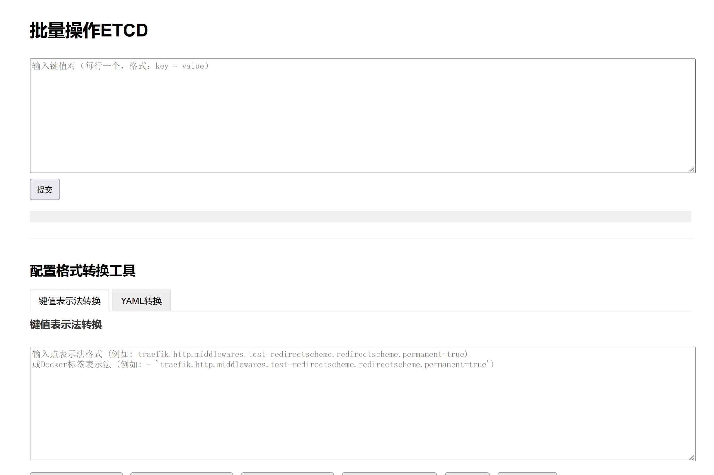

# etcdweb - simple to put KV data to etcd

## Configuration

src/app.py
```python
# 配置ETCD连接（根据实际情况修改）
ETCD_HOST = '192.168.9.105'
ETCD_PORT = 2379
...
    app.run(host='0.0.0.0', port=5000)
```

## Usage

### simple to run
```bash
pipx install poetry
poetry install --no-root
poetry run python ./src/app.py
```


### with docker-compose
```bash
docker compose up -d
```
### with traefik

```yml
    labels:
      - traefik.enable=true
      - traefik.http.routers.etcdweb.rule=Host(`etcdweb.example.com`)
    networks:
        traefik:
            external: true
```
warn: there is no auth!!!

## License

MIT License
Copyright (c) 2023
Written by [axuanran](https://github.com/axuanran)
[MIT License](https://github.com/axuanran/etcdweb/blob/main/LICENSE)
[](https://github.com/axuanran/etcdweb/blob/main/LICENSE)